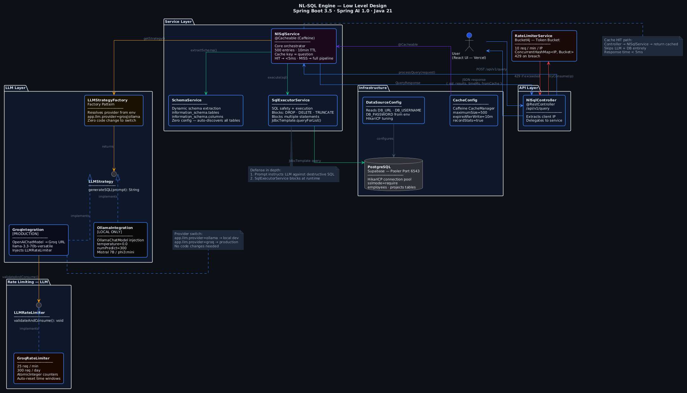

# NL-SQL Engine

A production-grade natural language to SQL engine powered by Spring AI and LLMs. Ask questions in plain English, get SQL queries executed against a real PostgreSQL database — with caching, rate limiting, and multi-provider LLM support.

**Live Demo**: https://nl-sql-client.vercel.app  
**Backend**: https://nl-sql-engine.onrender.com/api/v1/query/health

---

## What it does

You type: `Show me all active projects with the name of the employee assigned to them`

It returns:
```json
{
  "generatedSql": "SELECT p.name, p.status, e.name AS employee FROM projects p LEFT JOIN employees e ON p.assigned_to = e.id WHERE p.status ILIKE 'active'",
  "results": [
    { "name": "Payment Gateway", "status": "active", "employee": "Chinmay Shivratriwar" },
    { "name": "ML Pipeline", "status": "active", "employee": "Rahul Verma" }
  ],
  "executionTimeMs": 1843,
  "fromCache": false
}
```

---

## Architecture


```
User (React UI)
      │
      ▼
NlSqlController
      │
      ├──► RateLimiterService (Bucket4j — 10 req/min per IP)
      │
      ▼
NlSqlService (@Cacheable — Caffeine)
      │
      ├──► SchemaService
      │         └── Extracts all tables + columns from PostgreSQL information_schema
      │
      ├──► LLMFactory
      │         └── reads app.llm.provider from env
      │                   ├── OllamaIntegration  (local dev)
      │                   └── GroqIntegration    (production)
      │                             └── GroqRateLimiter (LLMRateLimiter interface)
      │
      ├──► SqlExecutorService
      │         ├── Blocks destructive queries (DROP, DELETE, TRUNCATE...)
      │         ├── Blocks multiple statements
      │         └── Executes SELECT via JdbcTemplate
      │
      └──► QueryResponse { question, generatedSql, results, executionTimeMs, fromCache }
```

> Full LLD diagram: [docs/lld.puml](docs/lld.puml)
---

## Design Decisions

**Strategy + Factory Pattern for LLM providers**  
Adding a new LLM provider (OpenAI, Anthropic) requires only a new class implementing `LLMStrategy` and one line in `LLMFactory`. Zero changes to existing code. Provider switches via a single env variable — `app.llm.provider=groq`.

**Two-layer rate limiting**  
IP-based limiting (Bucket4j) protects the API from abuse. A separate `LLMRateLimiter` interface with `GroqRateLimiter` implementation protects the Groq free tier quota. Concerns are separated — controller doesn't know about LLM limits, LLM strategy doesn't know about IP limits.

**Caffeine caching at service layer**  
Identical questions never hit the LLM twice. Cache sits at `NlSqlService` with a 10-minute TTL and 500 entry cap. Cached responses skip both rate limiters entirely.

**Schema-aware prompt engineering**  
`SchemaService` dynamically extracts the full schema from `information_schema` at query time and injects it into the LLM prompt. Adding a new table to the database requires zero code changes — the engine discovers it automatically.

**SQL safety layer**  
`SqlExecutorService` blocks destructive keywords and multiple statements before execution. The LLM prompt explicitly instructs against `GROUP BY` without aggregation and multiple statement generation — defense in depth.

---

## Tech Stack

| Layer | Technology |
|-------|-----------|
| Backend | Java 21, Spring Boot 3.5, Spring AI 1.0.0 |
| LLM | Groq API (llama-3.3-70b-versatile) / Ollama (local) |
| Database | PostgreSQL, Spring Data JPA, HikariCP |
| Caching | Caffeine |
| Rate Limiting | Bucket4j |
| Frontend | React, Vite, Axios |
| Deployment | Docker, Render (backend), Vercel (frontend), Supabase (DB) |

---

## Running Locally

**Prerequisites**: Java 21, Maven, PostgreSQL, Ollama

```bash
# Pull a local model
ollama pull mistral

# Clone and configure
git clone https://github.com/ChinmayShivratriwar/nl-sql-engine.git
cd nl-sql-engine
```

Set these in your IDE run config or as env variables:
```
DB_URL=jdbc:postgresql://localhost:5432/nlsql
DB_USERNAME=postgres
DB_PASSWORD=yourpassword
GROQ_KEY=your_groq_key
app.llm.provider=ollama   # or groq
```

```bash
mvn spring-boot:run
```

**Frontend:**
```bash
cd frontend
npm install
npm run dev
```

---

## API

### POST /api/v1/query
```json
// Request
{ "question": "Show me the highest paid employee in Engineering" }

// Response
{
  "question": "Show me the highest paid employee in Engineering",
  "generatedSql": "SELECT * FROM employees WHERE department ILIKE 'Engineering' ORDER BY salary DESC LIMIT 1",
  "results": [{ "id": 5, "name": "Vikram Singh", "department": "Engineering", "salary": 100000.00 }],
  "executionTimeMs": 1923,
  "fromCache": false,
  "error": null
}
```

### GET /api/v1/query/health
```
nl-sql-engine is running
```

---

## Environment Variables

| Variable | Description |
|----------|-------------|
| `DB_URL` | PostgreSQL JDBC URL |
| `DB_USERNAME` | Database username |
| `DB_PASSWORD` | Database password |
| `GROQ_KEY` | Groq API key |
| `app.llm.provider` | `groq` or `ollama` |
| `PORT` | Server port (default 8080) |
| `SPRING_PROFILES_ACTIVE` | `prod` for production |

---

## Sample Database Schema

| Table | Columns |
|-------|---------|
| `employees` | id, name, department, salary, hire_date |
| `projects` | id, name, budget, status, assigned_to, start_date |

> The engine auto-discovers any tables in the connected database — no hardcoding required.

## What's Next

- Dynamic datasource linking — users connect their own databases via host/credentials
- Redis-backed distributed rate limiting for multi-instance deployments
- Query history and analytics dashboard
- Support for additional LLM providers (OpenAI, Anthropic Claude)
